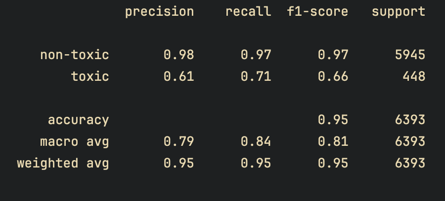

# Toxic Tweet Detection using Linear SVM

A classical NLP machine learning project to detect toxic content in tweets, built with **TF-IDF + Linear SVM**, designed to handle **class imbalance** without data leakage or oversampling.

This project focuses on **correct problem framing, metric selection, and decision discipline**, not gimmicks.

---

## Problem Statement

Online platforms need to identify toxic or abusive content reliably.  
The challenge is **class imbalance**: toxic tweets form a small minority, and naive accuracy-based models fail silently.

This project builds a **binary classifier** to label tweets as:
- `0` → Non-toxic  
- `1` → Toxic  

while explicitly prioritizing **minority-class recall**.

---

## Dataset Overview

- Total samples: ~32,000 tweets  
- Class distribution:
  - Non-toxic (0): ~93%
  - Toxic (1): ~7%

This imbalance is **typical for real-world moderation tasks** and is handled via **class-weighted learning**, not oversampling.

---

## Modeling Approach

### Text Representation
- **TF-IDF Vectorization**
  - Word n-grams: (1, 2)
  - Max features: 40,000
  - Sublinear TF scaling
  - Minimum document frequency: 3

### Classifier
- **Linear Support Vector Machine (LinearSVC)**
- `class_weight='balanced'` to counter class imbalance
- Chosen for:
  - Strong performance on sparse text data
  - Robust decision boundaries
  - Interpretability of feature weights

### Why NOT SMOTE or Oversampling?
- Oversampling text data distorts feature space
- Synthetic samples in TF-IDF space are often semantically invalid
- Class-weighted linear models are empirically superior for this task

---

## Evaluation Metrics

Accuracy is **not** a meaningful metric under imbalance and is not relied upon.

Primary metrics:
- Precision, Recall, F1-score (per class)
- Confusion Matrix
- False Negative Rate (missed toxic tweets)

### Test Set Results



- Toxic recall ≈ **71%**
- False Negative Rate ≈ **29%**
- False Positive Rate ≈ **3%**

This represents a **conservative but reliable baseline** suitable for real-world deployment.

---

## Model Saving

The full preprocessing + model pipeline is saved as a single artifact:

```python
joblib.dump(clf, "toxic_svm_pipeline.joblib")
```

## Streamlit Demo
A lightweight Streamlit app is provided to demonstrate live inference.
Features:
- User-input text
- Real-time prediction
- Uses the saved pipeline (no retraining)
This is intended as a functional demo, not a UI showcase.

## Key Takeaways
- Class imbalance was handled via decision weighting, not data duplication
- Threshold tuning is possible but intentionally excluded from this baseline
- Focus is on correct modeling discipline, not metric chasing-
- The model is simple, interpretable, and deployable

## Possible Extensions
- Character n-grams to capture obfuscated toxicity
- Threshold tuning based on application-specific FN constraints
- Error analysis on false negatives
- Probability calibration for confidence scoring

## Disclaimer
- This model is for educational and demonstrative purposes.
- Real-world moderation systems require continuous monitoring, retraining, and human oversight.